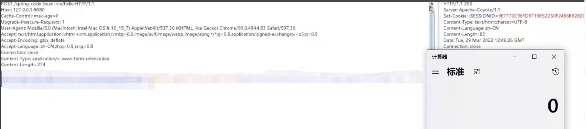

# Spring Core RCE

> After Spring Cloud, on March 29, another heavyweight vulnerability of Spring broke out on the Internet: Spring Core RCE 

## Circulating coding poc 
**The exploit has been uploaded so far ```exp.py```**  
  


## Spring's official patch is also actively rushing   
[Patch Links in Spring Production ](https://github.com/spring-projects/spring-framework/commit/7f7fb58dd0dae86d22268a4b59ac7c72a6c22529)

## Vulnerability Impact 
1. JDK version 9 and above 
2. Spring Framework or derived frameworks are used

## Bug fix suggestion 
At present, Spring has not officially released a patch, it is recommended to reduce the jdk version as a temporary solution

## Blue team
### Yara
* [Florian Roth - Spring4Shell webshells](https://github.com/Neo23x0/signature-base/blob/master/yara/expl_spring4shell.yar)
